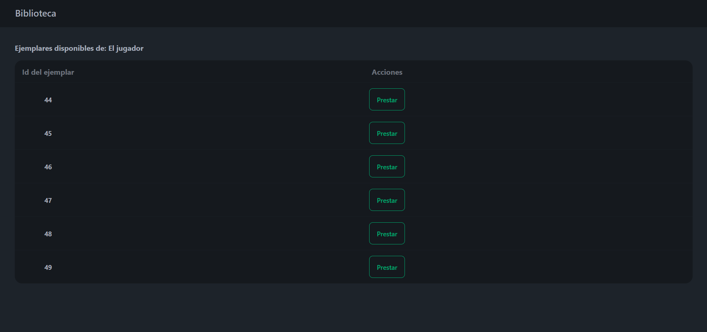

# Ejercicio:

##  Proyecto biblioteca
1)  Crear una pantalla donde se pueda ver un catálogo de libros, con la posibilidad de:
    - editar libro (botón en tabla)
    - eliminar libro (botón en tabla)
    - agregar libro (botón fuera de la tabla)
    - ver listado de préstamos de libro (botón para mostrar listado)
    - ver cantidad de ejemplares por libro / ver ejemplares sin prestar (disponibles)
    - registar préstamo de libro (botón para mostrar formulario de prestamo)

1)  Crear una pantalla (o modal de preferencia) para mostrar listado de préstamos realizado por libro, con la posibilidad de:
    - recibir un libro prestado ( botón en tabla )

1)  Crear un formulario para registrar el prestamo de un libro

- Hay libertad para la creación de la estructura de base de datos, pero se espera como mínimo:
    - Una tabla de libros
        - una columna de título
        - una columna de ubicación
        - una columna de cantidad de ejemplares
        - vinculo con tabla de autores
    - Una tabla de autores asociada a libros
        - una columna de nombre de autor
        - una columna de fecha de nacimiento
    - Una tabla de préstamos de libros
        - una columna con nombre de persona que retiró el libro
        - una columna de fecha de préstamo
        - una columna de fecha de devolución
        - vínculo con tabla de libro prestado

## Ejecución
#### 1. Vista de catálogo de libros

#### 2. Formulario para la edición de un libro

#### 3. Formulario para la creación de un nuevo libro

#### 4. Vista de préstamos activos de un libro

#### 5. Vista de ejemplares disponibles de un libro

#### 6. Formulario para la creación de un préstamo
